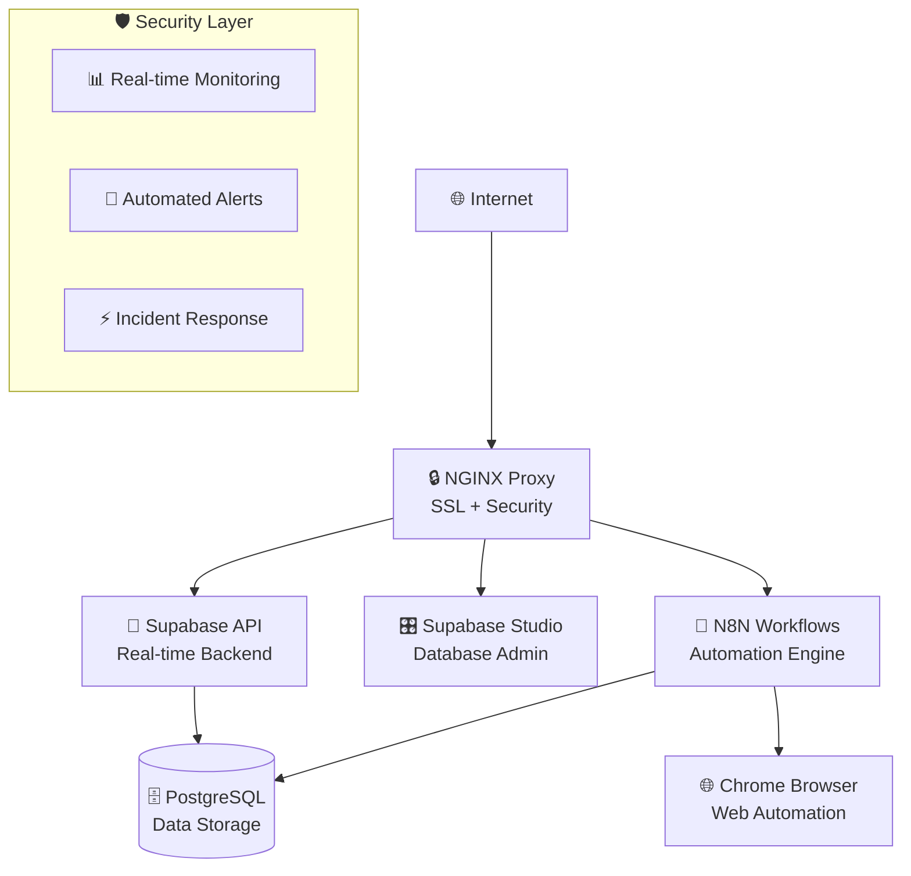

# 🧠 jstack - AI Second Brain Infrastructure

[](https://opensource.org/licenses/MIT)
[](https://www.docker.com/)
[](https://www.debian.org/)
[](https://nginx.org/)

> **Transform your business with AI automation that works while you sleep. Get your complete AI Second Brain running in 15 minutes.**

## What is jstack?

jstack is your AI Second Brain—a comprehensive system designed to work while you sleep, making burnout obsolete and freeing up time for what matters most. Built on N8N workflows and developed by the [AI Productivity Hub](https://www.skool.com/ai-productivity-hub/about) community, it's the "one AI that runs everything."

Unlike corporate AI assistants, jstack is designed with a clear mission: help business owners and professionals save 10+ hours per week through intelligent automation while maintaining complete ownership of their data.

## 🚀 Quick Start - Get Running in 15 Minutes

**⚠️ Before You Start**: jstack automatically handles Docker installation, security configuration, SSL certificates, and service deployment. You only need to handle DNS setup and basic configuration.

**✅ What jstack automates for you:**
- Docker installation and security configuration
- Firewall setup (UFW) with proper rules
- SSL certificates via Let's Encrypt with auto-renewal
- Service user creation with minimal privileges
- Container deployment and network isolation
- Health monitoring and automatic restarts

### Step 1: Prerequisites ✅

**What you need to provide:**
- Ubuntu/Debian server with sudo access
- Domain name with DNS control
- Email address (for SSL certificates)

### Step 2: DNS Setup (Required!) 🌐

**✅ REQUIRED DNS A records for base jstack installation:**

```bash
# These 3 subdomains are required:
n8n.yourdomain.com      → Your Server IP  
studio.yourdomain.com   → Your Server IP
supabase.yourdomain.com → Your Server IP

# Example if your server IP is 203.0.113.1:
# n8n.yourdomain.com      A    203.0.113.1
# studio.yourdomain.com   A    203.0.113.1  
# supabase.yourdomain.com A    203.0.113.1
```

**🔗 OPTIONAL: Root domain (only needed for website deployment):**

```bash
# Only add this if you plan to use --add-site features:
yourdomain.com          → Your Server IP

# Example: yourdomain.com A 203.0.113.1
```

**⏱️ DNS Propagation**: Allow 15 minutes to 24 hours for DNS changes to take effect.

**✅ Test required DNS setup:**
```bash
dig +short n8n.yourdomain.com
```
```bash
dig +short studio.yourdomain.com
```
```bash
dig +short supabase.yourdomain.com
```

**🔗 Test optional DNS (if you added root domain):**
```bash
dig +short yourdomain.com
```

### Step 3: Get jstack & Configure ⬇️

```bash
git clone https://github.com/odysseyalive/jstack.git
```
```bash
cd jstack
```

```bash
cp jstack.config.default jstack.config
```
```bash
nano jstack.config
```

**⚠️ REQUIRED**: Edit these two lines in the config file:
```
DOMAIN=your-domain.com
EMAIL=your-email@domain.com
```

### Step 4: Deploy 🚀

**Option A: Standard Installation (Recommended)**
```bash
./jstack.sh --configure-sudo
```
```bash
./jstack.sh --install
```

**Option B: Force Installation (If Option A fails)**
```bash
./jstack.sh --force-install
```

**Option C: Validate First (Safest)**
```bash
./jstack.sh --dry-run
```
```bash
./jstack.sh --install
```

⏱️ **Installation takes 5-10 minutes** - grab coffee and watch the colored progress logs!

### Step 5: Access Your AI Second Brain 🎉

Once deployment completes, visit:

- **🧠 AI Workflows**: `https://n8n.your-domain.com` - Build and manage automations
- **📊 Database Studio**: `https://studio.your-domain.com` - Manage your PostgreSQL database
- **🔍 API Access**: `https://supabase.your-domain.com` - REST API for integrations

## 🔍 What Happens During Installation?

**jstack handles everything automatically so you don't have to:**

### 🏗️ System Preparation
- **Docker Installation**: Automatic Docker setup with security hardening
- **Service User**: Creates dedicated `jarvis` user with minimal privileges  
- **Firewall**: Configures UFW with secure rules (ports 80, 443, 22 only)
- **Directory Structure**: Creates organized directory structure under `/home/jarvis/jarvis-stack/`
- **Logging**: Sets up comprehensive logging system with automatic cleanup

### 🐳 Container Deployment  
- **PostgreSQL Database**: Production-tuned database with 4GB memory limit
- **Supabase Stack**: Full-featured backend-as-a-service with API + Studio
- **N8N Workflows**: Visual automation platform with 2GB memory allocation
- **Chrome Automation**: Headless browser for web interactions (4GB limit, 5 instances)
- **Network Isolation**: Secure Docker networks prevent unauthorized access

### 🔒 Security & SSL
- **SSL Certificates**: Automatic Let's Encrypt certificates for all subdomains
- **NGINX Proxy**: Reverse proxy with rate limiting, compression, security headers
- **Certificate Renewal**: Automatic SSL renewal prevents expiration issues
- **Container Security**: Rootless containers, no unnecessary privileges
- **Network Security**: Services isolated in private networks, NGINX-only public access

### 🔄 Service Orchestration
- **Health Monitoring**: Automatic health checks with restart on failure
- **Service Dependencies**: Proper startup order ensuring database before applications
- **Configuration**: Auto-generated secrets and optimized service configurations
- **Backup System**: Automated backup system with configurable retention

### 🌐 Want to Deploy Websites Too?

jstack now includes **site templates** for rapid website deployment:

```bash
./jstack.sh --add-site mybusiness.com --template nextjs-business
```
```bash
./jstack.sh --add-site myportfolio.com --template hugo-portfolio
```
```bash
./jstack.sh --add-site myapp.com --template lamp-webapp
```

**📚 [Complete Site Templates Guide →](docs/guides/site-templates.md)**

---

## 🆘 Need Help?

### 🧪 **Fail-Fast Validation (Recommended First Step)**

**Avoid installation problems by validating your setup first:**

```bash
./jstack.sh --dry-run
```
```bash
./jstack.sh --configure-sudo
```
```bash
dig +short yourdomain.com
```
```bash
dig +short n8n.yourdomain.com
```
```bash
dig +short studio.yourdomain.com
```
```bash
dig +short supabase.yourdomain.com
```

### 🔥 **Emergency Troubleshooting**

Something broken? Try these first:

```bash
docker ps
```
```bash
tail -f /home/jarvis/jarvis-stack/logs/setup_*.log
```
```bash
./jstack.sh --restart-services
```

### 🚨 **Common Installation Issues**

**DNS Not Ready**
```bash
./jstack.sh --configure-ssl
```

**Sudo Password Prompts** 
```bash
./jstack.sh --configure-sudo
```
```bash
./jstack.sh --install
```

**Docker Installation Fails**
```bash
curl -fsSL https://get.docker.com/rootless | sh
```
```bash
./jstack.sh --force-install
```

### 📞 **Get Support**

- **🐛 Bug Reports**: [GitHub Issues](https://github.com/odysseyalive/jstack/issues)
- **💬 Community**: [AI Productivity Hub](https://www.skool.com/ai-productivity-hub)
- **📖 Documentation**: All guides linked below
- **📧 Enterprise Support**: <enterprise@jstack.com>

---

## ✅ Installation Complete? Here's What's Next

**First time with N8N workflows?** Check out these starter automations:
- **Email Management**: Auto-sort and respond to common emails
- **Social Media**: Schedule posts across platforms  
- **CRM Integration**: Sync contacts between tools automatically
- **Data Processing**: Extract and organize information from documents

**Ready to build custom workflows?** Visit `https://n8n.your-domain.com` and explore the 400+ integrations.

---

## 📚 What's Your Experience Level?

Choose your documentation path:

### 🟢 **New to Automation** (Start Here!)

- **⏱️ 15 min**: [Complete Installation Guide](docs/guides/installation.md) - Step-by-step with screenshots
- **⏱️ 10 min**: [Configuration Basics](docs/guides/configuration.md) - Edit config files with confidence
- **⏱️ 5 min**: [First Workflow Tutorial](docs/guides/first-workflow.md) - Create your first automation

### 🟡 **Some Experience** (Task-Focused Guides)

- **⏱️ 20 min**: [Service Management](docs/guides/service-management.md) - Start, stop, restart services
- **⏱️ 15 min**: [Backup & Recovery](docs/guides/backup-recovery.md) - Protect your data
- **⏱️ 30 min**: [Domain & SSL Setup](docs/guides/ssl-domains.md) - Custom domains and certificates
- **⏱️ 45 min**: [Troubleshooting Guide](docs/guides/troubleshooting.md) - Fix common issues

### 🔴 **Advanced Users** (Technical References)

- **📋 [System Architecture](docs/reference/architecture.md)** - Complete technical overview
- **⚙️ [Configuration Reference](docs/reference/configuration-ref.md)** - All configuration options
- **🔒 [Security Documentation](docs/reference/security.md)** - Enterprise security features  
- **🛠️ [Developer Guide](docs/reference/developer-guide.md)** - Extend and customize jstack

### ⚫ **Experts & Contributors**

- **🏗️ [Architecture Deep Dive](docs/reference/architecture-deep-dive.md)** - Internal implementation details
- **🧪 [Development Setup](docs/reference/development.md)** - Contribute to jstack
- **📊 [Performance Tuning](docs/reference/performance.md)** - Optimize for scale

---

## ✨ What You Get Out of the Box

### 🧠 **AI Second Brain Components**

- **N8N Workflow Engine** (`n8n.yourdomain.com`) - Visual automation builder with 400+ integrations
- **Supabase API Server** (`supabase.yourdomain.com`) - PostgreSQL database with real-time APIs and authentication  
- **Supabase Studio** (`studio.yourdomain.com`) - Web-based database admin interface (like phpMyAdmin for PostgreSQL)
- **Chrome Browser Automation** - Headless browser for web interactions and automation

### 🔒 **Enterprise Security** (New in v2.0!)

- **Multi-layered Protection** - fail2ban, firewall, SSL encryption, container isolation
- **Real-time Monitoring** - Security dashboard with instant alerts and metrics
- **Compliance Ready** - SOC 2, GDPR, ISO 27001 compliance frameworks built-in
- **Automated Response** - Threat detection with automatic containment and reporting

### 🎛️ **Production Operations**

- **One-Command Deployment** - Complete stack with single command
- **Automatic SSL** - Let's Encrypt certificates with auto-renewal
- **Health Monitoring** - Service status with automatic restart capabilities
- **Zero-Downtime Updates** - Update system without interrupting workflows

---

## 🆘 Need Help?

### 🔥 **Emergency Troubleshooting**

Something broken? Try these first:

```bash
./jstack.sh --status
```
```bash
./jstack.sh --logs
```
```bash
./jstack.sh --restart
```

### 📞 **Get Support**

- **🐛 Bug Reports**: [GitHub Issues](https://github.com/odysseyalive/jstack/issues)
- **💬 Community**: [AI Productivity Hub](https://www.skool.com/ai-productivity-hub)
- **📖 Documentation**: All guides linked above
- **📧 Enterprise Support**: <enterprise@jstack.com>

### 🔍 **Quick Diagnostics**

```bash
./jstack.sh --validate
```
```bash
./jstack.sh --test-connections
```
```bash
./jstack.sh --security-check
```

---

## 🎯 Why jstack?

### **The Problem We Solve**

Business owners and professionals waste 15+ hours per week on repetitive tasks that should be automated. Existing solutions either:

- ❌ Lock you into proprietary platforms (lose control of your data)
- ❌ Require extensive technical knowledge (too complex for business users)  
- ❌ Don't integrate with your existing tools (creates more work)

### **The jstack Solution**

✅ **Complete Data Ownership** - Everything runs on your infrastructure  
✅ **15-Minute Setup** - From zero to working AI automation in minutes  
✅ **400+ Integrations** - Connect all your existing business tools  
✅ **Enterprise Security** - Military-grade protection without complexity  
✅ **Visual Workflow Builder** - No coding required, but coding supported  
✅ **24/7 Autonomous Operation** - Your AI works while you sleep  

### **Real Results from Real Users**

- **Sarah's Agency**: Automated client onboarding, saved 12 hours/week
- **Mike's SaaS**: Integrated customer support workflows, 85% response improvement  
- **Tech Startup**: Automated CI/CD and monitoring, deployed 3x faster

---

## 🎪 Advanced Operations (For Experienced Users)

<details>
<summary><strong>🔧 System Management Commands</strong></summary>

```bash
./jstack.sh --backup
```
```bash
./jstack.sh --restore
```
```bash
./jstack.sh --update
```
```bash
./jstack.sh --uninstall
```
```bash
./jstack.sh --dry-run
```
```bash
./jstack.sh --restart-n8n
```
```bash
./jstack.sh --restart-db
```
```bash
./jstack.sh --ssl-renew
```

</details>

<details>
<summary><strong>🔒 Security Operations</strong></summary>

```bash
./jstack.sh --security-scan
```
```bash
./jstack.sh --compliance-check
```
```bash
./jstack.sh --incident-response
```
```bash
./jstack.sh --view-security-logs
```

</details>

<details>
<summary><strong>📊 Monitoring & Metrics</strong></summary>

```bash
./jstack.sh --metrics
```
```bash
./jstack.sh --health-check
```
```bash
./jstack.sh --generate-report
```
```bash
./jstack.sh --view-dashboard
```

</details>

---

## 🏗️ Technical Architecture (High Level)



**🔗 For Complete Technical Details**: See [System Architecture Documentation](docs/reference/architecture.md)

---

## 📄 License & Credits

**MIT License** - Use commercially, modify, distribute freely. See [LICENSE](LICENSE) for details.

**Built By**: [AI Productivity Hub Community](https://www.skool.com/ai-productivity-hub)  
**Powered By**: N8N, Supabase, Docker, NGINX  
**Security**: Enterprise-grade protection with automated monitoring

---

*🎯 **One AI that runs everything. Deploy your AI Second Brain in 15 minutes.***

**[⬆️ Back to Quick Start](#-quick-start---new-to-ai-automation)**
