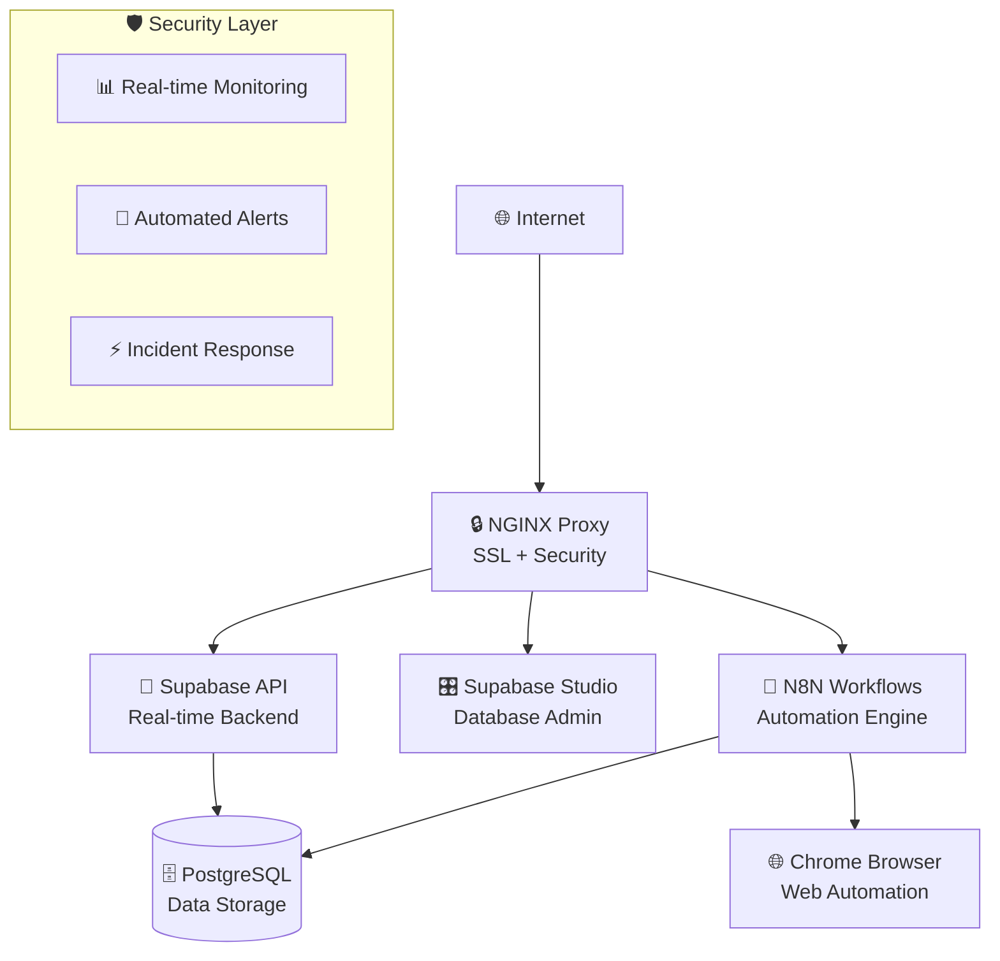

# 🧠 JarvisJR Stack - AI Second Brain Infrastructure

[](https://opensource.org/licenses/MIT)
[](https://www.docker.com/)
[](https://www.debian.org/)
[](https://nginx.org/)

> **Transform your business with AI automation that works while you sleep. Get your complete AI Second Brain running in 15 minutes.**

## What is JarvisJR?

JarvisJR is your AI Second Brain—a comprehensive system designed to work while you sleep, making burnout obsolete and freeing up time for what matters most. Built on N8N workflows and developed by the [AI Productivity Hub](https://www.skool.com/ai-productivity-hub/about) community, it's the "one AI that runs everything."

Unlike corporate AI assistants, JarvisJR is designed with a clear mission: help business owners and professionals save 10+ hours per week through intelligent automation while maintaining complete ownership of their data.

## 🚀 Quick Start - New to AI Automation?

**⏱️ 15 minutes to your first AI workflow**

### Step 1: Prerequisites Check ✅

```bash
# Verify you have:
# ✅ Ubuntu/Debian server with sudo access  
# ✅ Domain name pointed to your server
# ✅ Email address for SSL certificates

# Quick system check:
curl -fsSL https://get.docker.com | sh  # Install Docker if needed
```

### Step 1.5: DNS Setup (Required!) 🌐

**Create these DNS A records BEFORE installation:**

```bash
# Point these subdomains to your server IP:
yourdomain.com          → Your Server IP
n8n.yourdomain.com      → Your Server IP  
studio.yourdomain.com   → Your Server IP
api.yourdomain.com      → Your Server IP

# Example if your server IP is 203.0.113.1:
# yourdomain.com          A    203.0.113.1
# n8n.yourdomain.com      A    203.0.113.1
# studio.yourdomain.com   A    203.0.113.1  
# api.yourdomain.com      A    203.0.113.1
```

**⏱️ DNS Propagation**: Allow 15 minutes to 24 hours for DNS changes to take effect.

**✅ Test DNS Setup:**

```bash
# Test each subdomain resolves to your server:
dig +short yourdomain.com
dig +short n8n.yourdomain.com
dig +short studio.yourdomain.com
dig +short api.yourdomain.com
# All should return your server IP
```

### Step 1: Get JarvisJR ⬇️

```bash
git clone https://github.com/your-repo/JarvisJR_Stack.git
cd JarvisJR_Stack
```

### Step 2: Configure (2 minutes) ⚙️

```bash
# Copy and edit your configuration:
cp jstack.config.default jstack.config
nano jstack.config

# ⚠️ REQUIRED: Edit these two lines:
# DOMAIN=your-domain.com
# EMAIL=your-email@domain.com
```

### Step 3: Deploy 🚀

```bash
# Deploy complete AI infrastructure:
./jstack.sh

# ☕ Grab coffee - this takes 5-10 minutes
# Watch the progress with colored logs
```

### Step 4: Access Your AI Second Brain 🎉

Once deployment completes, visit:

- **🧠 AI Workflows**: `https://n8n.your-domain.com` - Build and manage automations
- **📊 Database Studio**: `https://studio.your-domain.com` - Manage your PostgreSQL database
- **🔍 API Access**: `https://api.your-domain.com` - REST API for integrations

**🎯 Success Indicator**: You can log into all three services without errors.

---

## 📚 What's Your Experience Level?

Choose your documentation path:

### 🟢 **New to Automation** (Start Here!)

- **⏱️ 15 min**: [Complete Installation Guide](docs/guides/installation.md) - Step-by-step with screenshots
- **⏱️ 10 min**: [Configuration Basics](docs/guides/configuration.md) - Edit config files with confidence
- **⏱️ 5 min**: [First Workflow Tutorial](docs/guides/first-workflow.md) - Create your first automation

### 🟡 **Some Experience** (Task-Focused Guides)

- **⏱️ 20 min**: [Service Management](docs/guides/service-management.md) - Start, stop, restart services
- **⏱️ 15 min**: [Backup & Recovery](docs/guides/backup-recovery.md) - Protect your data
- **⏱️ 30 min**: [Domain & SSL Setup](docs/guides/ssl-domains.md) - Custom domains and certificates
- **⏱️ 45 min**: [Troubleshooting Guide](docs/guides/troubleshooting.md) - Fix common issues

### 🔴 **Advanced Users** (Technical References)

- **📋 [System Architecture](docs/reference/architecture.md)** - Complete technical overview
- **⚙️ [Configuration Reference](docs/reference/configuration-ref.md)** - All configuration options
- **🔒 [Security Documentation](docs/reference/security.md)** - Enterprise security features  
- **🛠️ [Developer Guide](docs/reference/developer-guide.md)** - Extend and customize JarvisJR

### ⚫ **Experts & Contributors**

- **🏗️ [Architecture Deep Dive](docs/reference/architecture-deep-dive.md)** - Internal implementation details
- **🧪 [Development Setup](docs/reference/development.md)** - Contribute to JarvisJR
- **📊 [Performance Tuning](docs/reference/performance.md)** - Optimize for scale

---

## ✨ What You Get Out of the Box

### 🧠 **AI Second Brain Components**

- **N8N Workflow Engine** (`n8n.yourdomain.com`) - Visual automation builder with 400+ integrations
- **Supabase API Server** (`api.yourdomain.com`) - PostgreSQL database with real-time APIs and authentication  
- **Supabase Studio** (`studio.yourdomain.com`) - Web-based database admin interface (like phpMyAdmin for PostgreSQL)
- **Chrome Browser Automation** - Headless browser for web interactions and automation

### 🔒 **Enterprise Security** (New in v2.0!)

- **Multi-layered Protection** - fail2ban, firewall, SSL encryption, container isolation
- **Real-time Monitoring** - Security dashboard with instant alerts and metrics
- **Compliance Ready** - SOC 2, GDPR, ISO 27001 compliance frameworks built-in
- **Automated Response** - Threat detection with automatic containment and reporting

### 🎛️ **Production Operations**

- **One-Command Deployment** - Complete stack with single command
- **Automatic SSL** - Let's Encrypt certificates with auto-renewal
- **Health Monitoring** - Service status with automatic restart capabilities
- **Zero-Downtime Updates** - Update system without interrupting workflows

---

## 🆘 Need Help?

### 🔥 **Emergency Troubleshooting**

Something broken? Try these first:

```bash
# Check all services
./jstack.sh --status

# View recent logs
./jstack.sh --logs

# Restart everything
./jstack.sh --restart
```

### 📞 **Get Support**

- **🐛 Bug Reports**: [GitHub Issues](https://github.com/your-repo/issues)
- **💬 Community**: [AI Productivity Hub](https://www.skool.com/ai-productivity-hub)
- **📖 Documentation**: All guides linked above
- **📧 Enterprise Support**: <enterprise@jarvisjr.com>

### 🔍 **Quick Diagnostics**

```bash
# System health check
./jstack.sh --validate

# Test all connections
./jstack.sh --test-connections

# Security scan
./jstack.sh --security-check
```

---

## 🎯 Why JarvisJR?

### **The Problem We Solve**

Business owners and professionals waste 15+ hours per week on repetitive tasks that should be automated. Existing solutions either:

- ❌ Lock you into proprietary platforms (lose control of your data)
- ❌ Require extensive technical knowledge (too complex for business users)  
- ❌ Don't integrate with your existing tools (creates more work)

### **The JarvisJR Solution**

✅ **Complete Data Ownership** - Everything runs on your infrastructure  
✅ **15-Minute Setup** - From zero to working AI automation in minutes  
✅ **400+ Integrations** - Connect all your existing business tools  
✅ **Enterprise Security** - Military-grade protection without complexity  
✅ **Visual Workflow Builder** - No coding required, but coding supported  
✅ **24/7 Autonomous Operation** - Your AI works while you sleep  

### **Real Results from Real Users**

- **Sarah's Agency**: Automated client onboarding, saved 12 hours/week
- **Mike's SaaS**: Integrated customer support workflows, 85% response improvement  
- **Tech Startup**: Automated CI/CD and monitoring, deployed 3x faster

---

## 🎪 Advanced Operations (For Experienced Users)

<details>
<summary><strong>🔧 System Management Commands</strong></summary>

```bash
# Complete system operations
./jstack.sh --backup          # Create timestamped backup
./jstack.sh --restore         # Interactive restore from backup
./jstack.sh --update          # Update JarvisJR to latest version
./jstack.sh --uninstall       # Complete system removal
./jstack.sh --dry-run         # Test changes without applying

# Service-specific operations  
./jstack.sh --restart-n8n     # Restart N8N workflow engine
./jstack.sh --restart-db      # Restart PostgreSQL database
./jstack.sh --ssl-renew       # Force SSL certificate renewal
```

</details>

<details>
<summary><strong>🔒 Security Operations</strong></summary>

```bash
# Security monitoring and validation
./jstack.sh --security-scan           # Comprehensive security assessment
./jstack.sh --compliance-check        # SOC2/GDPR/ISO27001 validation
./jstack.sh --incident-response       # Emergency security response
./jstack.sh --view-security-logs      # Review security events
```

</details>

<details>
<summary><strong>📊 Monitoring & Metrics</strong></summary>

```bash
# System monitoring
./jstack.sh --metrics                 # View system performance metrics
./jstack.sh --health-check            # Comprehensive health validation  
./jstack.sh --generate-report         # System status report
./jstack.sh --view-dashboard           # Open monitoring dashboard
```

</details>

---

## 🏗️ Technical Architecture (High Level)



**🔗 For Complete Technical Details**: See [System Architecture Documentation](docs/reference/architecture.md)

---

## 📄 License & Credits

**MIT License** - Use commercially, modify, distribute freely. See [LICENSE](LICENSE) for details.

**Built By**: [AI Productivity Hub Community](https://www.skool.com/ai-productivity-hub)  
**Powered By**: N8N, Supabase, Docker, NGINX  
**Security**: Enterprise-grade protection with automated monitoring

---

*🎯 **One AI that runs everything. Deploy your AI Second Brain in 15 minutes.***

**[⬆️ Back to Quick Start](#-quick-start---new-to-ai-automation)**
