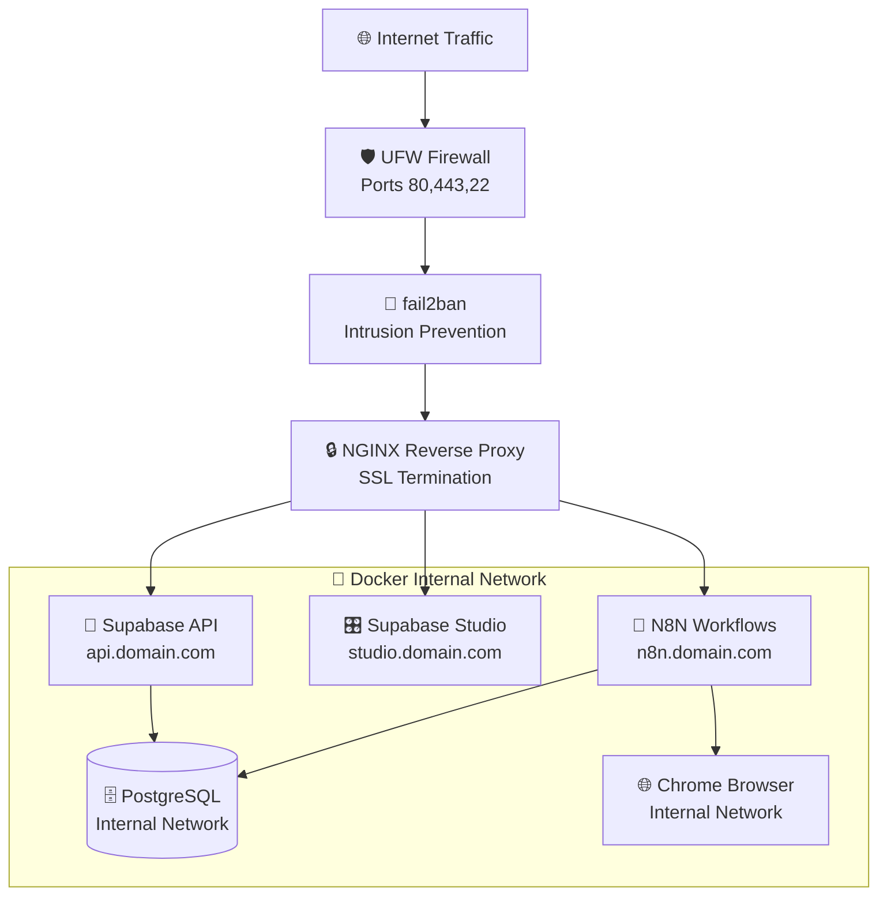

# 🏗️ jstack Technical Architecture

**🔴 Advanced Users** | **⏱️ 30+ minutes reading**

> **Comprehensive technical documentation covering the complete system architecture, design patterns, and implementation details of jstack.**

## 📋 Table of Contents

- [System Overview](#system-overview)
- [Core Components](#core-components)
- [Network Architecture](#network-architecture)  
- [Security Architecture](#security-architecture)
- [Data Flow & Integration](#data-flow--integration)
- [Deployment Architecture](#deployment-architecture)
- [Monitoring & Observability](#monitoring--observability)
- [Scalability & Performance](#scalability--performance)

---

## 🎯 System Overview

### **Design Philosophy**
jstack is built on four core principles:

1. **🛡️ Security-First Architecture** - Every component designed with enterprise security as the foundation
2. **📦 Modular Containerization** - Isolated services with clear boundaries and minimal dependencies
3. **🔧 Infrastructure as Code** - Complete system reproducible through configuration and scripts
4. **🚀 Production-Ready by Default** - No additional configuration required for production deployment

### **Technical Stack**
```yaml
Frontend Layer:     N8N Workflow Builder, Supabase Studio
Application Layer:  N8N Engine, Supabase API Server  
Data Layer:         PostgreSQL Database with real-time capabilities
Infrastructure:     Docker Compose, NGINX Reverse Proxy
Security:           fail2ban, UFW, Let's Encrypt, Container Isolation
Monitoring:         Custom security monitoring, alerting, compliance systems
```

---

## 🏛️ Core Components

### **1. N8N Workflow Engine**
```yaml
Container: n8n-jarvis
Purpose: Visual workflow automation and orchestration
Technology: Node.js application with visual editor
Resources: 2GB RAM, unlimited CPU
Storage: PostgreSQL backend for workflow persistence
Network: Internal Docker network + NGINX proxy
```

**Key Features:**
- **Visual Workflow Designer** - Drag-and-drop automation builder
- **400+ Pre-built Integrations** - Connect to popular services without coding
- **Custom Code Execution** - JavaScript and Python code execution in workflows
- **Webhook Support** - HTTP endpoints for external system integration
- **Scheduled Execution** - Cron-based and event-triggered workflow execution

**Architecture Patterns:**
- **Event-Driven Processing** - Workflows triggered by webhooks, schedules, or data changes
- **Stateless Execution** - Each workflow execution is independent and stateless
- **Persistent State** - Workflow definitions and execution history stored in PostgreSQL
- **Resource Isolation** - Workflows execute in isolated processes with resource limits

### **2. Supabase Backend Infrastructure**
```yaml
Container: supabase-stack (multi-service)
Components:
  - PostgreSQL Database (primary data store)
  - PostgREST API Server (automatic REST API generation)
  - Supabase Studio (database administration interface)
  - Realtime Server (WebSocket connections for live data)
  - Auth Server (user authentication and authorization)
```

**PostgreSQL Configuration:**
- **Version**: PostgreSQL 15+ with optimized settings
- **Memory**: 4GB allocated with shared buffers optimization
- **Extensions**: PostGIS, pg_stat_statements, pg_cron enabled
- **Backup**: Automated daily backups with point-in-time recovery
- **Replication**: Configured for read replicas in production

**API Architecture:**
- **Auto-Generated APIs** - REST endpoints automatically created from database schema
- **Real-time Subscriptions** - WebSocket connections for live data synchronization
- **Row Level Security** - Fine-grained access control at the database level
- **Connection Pooling** - PgBouncer for efficient database connection management

### **3. Chrome Browser Automation**
```yaml
Container: chrome-jarvis
Purpose: Headless browser automation for web interactions
Technology: Google Chrome in headless mode with debugging protocol
Resources: 4GB RAM, 5 concurrent instances maximum
Security: Sandboxed execution with restricted capabilities
```

**Automation Capabilities:**
- **Web Scraping** - Extract data from websites and web applications
- **Form Automation** - Fill forms, click buttons, navigate complex workflows
- **PDF Generation** - Convert web content to PDF documents
- **Screenshot Capture** - Automated visual testing and documentation
- **API Testing** - Browser-based API testing and validation

---

## 🌐 Network Architecture

### **Traffic Flow**


### **Network Segmentation**
```yaml
Public Network:
  - NGINX Reverse Proxy (ports 80, 443)
  - SSH Access (port 22, rate limited)

Private Network (Docker):
  - All application containers
  - Internal service communication only
  - No direct external access

Isolated Network:
  - Database container
  - Restricted access from application layer only
```

### **DNS Configuration**
```yaml
Required DNS Records:
  yourdomain.com:           A → Server IP
  n8n.yourdomain.com:       A → Server IP  
  supabase.yourdomain.com:       A → Server IP
  studio.yourdomain.com:    A → Server IP

Optional Records:
  security.yourdomain.com:  A → Server IP  # Security dashboard
  *.yourdomain.com:         A → Server IP  # Wildcard for subdomains
```

---

## 🔒 Security Architecture

### **Multi-Layered Security Model**

#### **1. Network Security Layer**
```yaml
External Firewall (UFW):
  - Default: Deny all incoming
  - Allow: SSH (22), HTTP (80), HTTPS (443)
  - Rate limiting on all allowed ports

Intrusion Prevention (fail2ban):
  - Real-time log analysis
  - Automatic IP blocking for suspicious activity
  - Multiple jail configurations for different attack types
  - Geographic filtering and reputation-based blocking
```

#### **2. Application Security Layer**
```yaml
SSL/TLS Encryption:
  - Let's Encrypt certificates with automatic renewal
  - TLS 1.2+ with strong cipher suites
  - HSTS headers for enhanced security
  - Certificate transparency monitoring

Reverse Proxy Security:
  - Rate limiting per endpoint
  - Request size limits
  - Header filtering and normalization  
  - DDoS protection with connection limits
```

#### **3. Container Security Layer**
```yaml
Docker Security:
  - Rootless container execution
  - Read-only root filesystems where possible
  - Minimal base images (Alpine Linux)
  - No privileged containers
  - Resource limits on all containers

Network Isolation:
  - Custom Docker networks
  - Service-specific network segments
  - No container-to-host network access
  - Internal DNS resolution only
```

#### **4. Data Security Layer**
```yaml
Database Security:
  - Encrypted data at rest
  - Connection encryption (SSL)
  - Role-based access control
  - Row-level security policies
  - Audit logging for all data access

Backup Security:
  - Encrypted backups
  - Secure backup storage locations
  - Access logging for backup operations
  - Retention policies with automatic cleanup
```

### **Security Monitoring & Response**
```yaml
Real-time Monitoring:
  - Security event correlation engine
  - Automated threat detection
  - Multi-channel alerting system
  - Security metrics dashboard

Incident Response:
  - Automated threat containment
  - Incident lifecycle management
  - Forensic evidence collection
  - Playbook-driven response workflows

Compliance Frameworks:
  - SOC 2 Type II controls
  - GDPR privacy compliance
  - ISO 27001 security management
  - Automated compliance reporting
```

---

## 🔄 Data Flow & Integration

### **Workflow Data Processing**
```yaml
Data Ingestion:
  - Webhook endpoints for external data
  - API polling for scheduled data collection
  - File uploads with virus scanning
  - Database change triggers

Data Transformation:
  - JavaScript and Python code execution
  - Built-in data transformation functions
  - Custom function libraries
  - Schema validation and mapping

Data Storage:
  - Primary storage in PostgreSQL
  - Temporary data in workflow memory
  - File attachments in secure storage
  - Audit trails for all data changes

Data Distribution:
  - REST API endpoints
  - Real-time WebSocket connections
  - Webhook notifications to external systems
  - Scheduled report generation
```

### **Integration Patterns**
```yaml
API Integration:
  - RESTful API consumption and production
  - GraphQL endpoint support
  - OAuth 2.0 and API key authentication
  - Rate limiting and error handling

Database Integration:
  - Native PostgreSQL connectivity
  - Connection pooling for performance
  - Transaction management
  - Prepared statements for security

File Processing:
  - Secure file upload handling
  - Virus scanning and validation
  - Multiple storage backend support
  - Automatic file compression and archiving

Real-time Communication:
  - WebSocket connections
  - Server-sent events
  - Push notifications
  - Event-driven architecture
```

---

## 🚀 Deployment Architecture

### **Container Orchestration**
```yaml
Docker Compose Configuration:
  Version: 3.8
  Networks: 
    - jarvis-public (nginx, exposed services)
    - jarvis-private (internal communication)
    - jarvis-db (database isolation)

Volume Management:
  - Named volumes for persistent data
  - Bind mounts for configuration files
  - Backup-friendly volume organization
  - Encrypted storage where required

Service Dependencies:
  - Database starts first
  - API services depend on database
  - NGINX starts after all services
  - Health checks ensure proper startup order
```

### **Configuration Management**
```yaml
Configuration Strategy:
  - Environment-based configuration
  - Secret management with Docker secrets
  - Configuration validation at startup
  - Hot-reloading where supported

File Structure:
  jstack.config.default  # Version-controlled defaults
  jstack.config          # User customizations (git-ignored)
  docker-compose.yml     # Generated from templates
  .env                   # Runtime environment variables
```

### **Service Discovery**
```yaml
Internal Communication:
  - Docker DNS for service discovery
  - Environment variable injection
  - Health check endpoints
  - Service mesh ready (future enhancement)

External Access:
  - NGINX reverse proxy routing
  - SSL termination at proxy layer
  - Load balancing for multiple instances
  - Subdomain-based service routing
```

---

## 📊 Monitoring & Observability

### **Logging Architecture**
```yaml
Log Aggregation:
  - Centralized logging with rsyslog
  - Container log collection via Docker logging driver
  - Log rotation and retention policies
  - Structured logging in JSON format

Log Analysis:
  - Real-time log parsing and correlation
  - Security event detection
  - Performance metrics extraction
  - Error tracking and alerting
```

### **Metrics Collection**
```yaml
System Metrics:
  - CPU, memory, disk, network utilization
  - Container resource usage
  - Database performance metrics
  - Application-specific metrics

Security Metrics:
  - Failed authentication attempts
  - Blocked IP addresses
  - Security rule violations
  - Compliance score tracking

Business Metrics:
  - Workflow execution statistics
  - API usage patterns
  - User activity metrics
  - Data processing volumes
```

### **Alerting & Notifications**
```yaml
Multi-Channel Alerting:
  - Email notifications with HTML templates
  - Slack integration with rich formatting
  - Syslog forwarding to SIEM systems
  - Desktop notifications for local alerts

Alert Management:
  - Severity-based routing
  - Rate limiting to prevent alert storms
  - Acknowledgment tracking
  - Escalation policies

Health Checks:
  - Application health endpoints
  - Database connectivity checks
  - External service dependency monitoring
  - SSL certificate expiration tracking
```

---

## ⚡ Scalability & Performance

### **Horizontal Scaling Patterns**
```yaml
Database Scaling:
  - Read replicas for query performance
  - Connection pooling with PgBouncer
  - Query optimization and indexing
  - Partition management for large tables

Application Scaling:
  - Multiple N8N instances behind load balancer
  - Stateless application design
  - Shared session storage
  - Auto-scaling based on resource utilization

Infrastructure Scaling:
  - Container orchestration with Docker Swarm/Kubernetes
  - Load balancing with NGINX Plus or HAProxy
  - CDN integration for static content
  - Multi-region deployment support
```

### **Performance Optimization**
```yaml
Database Performance:
  - Query optimization with EXPLAIN ANALYZE
  - Index optimization for common query patterns  
  - Connection pooling to reduce overhead
  - Materialized views for complex aggregations

Application Performance:
  - HTTP/2 and compression enabled
  - Static asset optimization and caching
  - Asynchronous processing where possible
  - Memory pooling for frequently used objects

Network Performance:
  - Keep-alive connections
  - Request/response compression
  - CDN for static content delivery
  - Geographic load balancing
```

### **Resource Management**
```yaml
Container Resource Limits:
  PostgreSQL: 4GB RAM, 2 CPU cores
  N8N: 2GB RAM, 1 CPU core  
  Chrome: 4GB RAM, 1 CPU core, 5 instances max
  NGINX: 512MB RAM, 1 CPU core
  
Monitoring Thresholds:
  Memory usage: Alert at 80%, critical at 95%
  CPU usage: Alert at 70%, critical at 90%
  Disk usage: Alert at 80%, critical at 95%
  Connection limits: Alert at 80% of maximum
```

---

## 🔧 Technical Implementation Details

### **Build Process**
```bash
# Modular script architecture
jstack.sh                    # Main orchestrator (routing only)
├── scripts/core/           # Core functionality modules
│   ├── setup.sh           # System preparation
│   ├── containers.sh      # Container management
│   ├── ssl.sh             # Certificate management
│   └── service_orchestration.sh
├── scripts/lib/           # Shared libraries
│   ├── common.sh          # Logging and utilities
│   └── validation.sh      # Input validation
└── scripts/security/      # Security systems
    ├── monitoring_system.sh
    ├── alerting_system.sh
    └── compliance_monitoring.sh
```

### **Security Implementation**
```bash
# Security system architecture
/opt/jarvis-security/
├── monitoring/            # Event correlation engine
├── alerting/             # Multi-channel alerts
├── compliance/           # SOC2/GDPR/ISO27001 checking
├── incidents/            # Incident response database
├── response/             # Automated response engine
├── validation/           # Security assessment engine
└── certificates/         # Security certificates
```

### **Configuration System**
```bash
# Two-file configuration pattern
jstack.config.default     # Version controlled defaults
jstack.config             # User overrides (git-ignored)

# Configuration loading order
1. Load defaults from jstack.config.default
2. Override with user values from jstack.config  
3. Validate required settings
4. Export to environment for child processes
```

---

## 🎓 Advanced Topics

### **Custom Extensions**
- **Plugin Architecture** - Extend N8N with custom nodes
- **Database Extensions** - Add PostgreSQL extensions for specialized functionality
- **Security Modules** - Implement custom security rules and monitoring
- **Integration Adapters** - Build connectors for proprietary systems

### **Multi-Environment Deployment**
- **Development** - Local development with Docker Compose
- **Staging** - Production-like environment for testing
- **Production** - High-availability deployment with monitoring
- **Disaster Recovery** - Cross-region backup and recovery procedures

### **Enterprise Features**
- **Single Sign-On** - SAML/OAuth integration for enterprise authentication
- **Advanced Monitoring** - Integration with enterprise monitoring systems
- **Compliance Automation** - Automated compliance reporting and evidence collection
- **Custom Branding** - White-label deployment options

---

## 📚 Related Documentation

### **For Developers**
- **[Developer Guide](developer-guide.md)** - Extend and customize jstack
- **[API Reference](api-reference.md)** - Complete API documentation
- **[Database Schema](database-schema.md)** - Complete data model

### **For Operations**
- **[Performance Tuning](performance.md)** - Optimize for scale and performance
- **[Security Guide](security.md)** - Comprehensive security documentation
- **[Monitoring Guide](monitoring.md)** - Advanced monitoring and alerting

### **For Compliance**
- **[SOC 2 Compliance](compliance-soc2.md)** - SOC 2 Type II implementation
- **[GDPR Compliance](compliance-gdpr.md)** - GDPR privacy controls
- **[ISO 27001 Compliance](compliance-iso27001.md)** - Information security controls

---

**[⬅️ Back to Documentation Hub](../../README.md#-whats-your-experience-level)** | **[➡️ Developer Guide](developer-guide.md)**